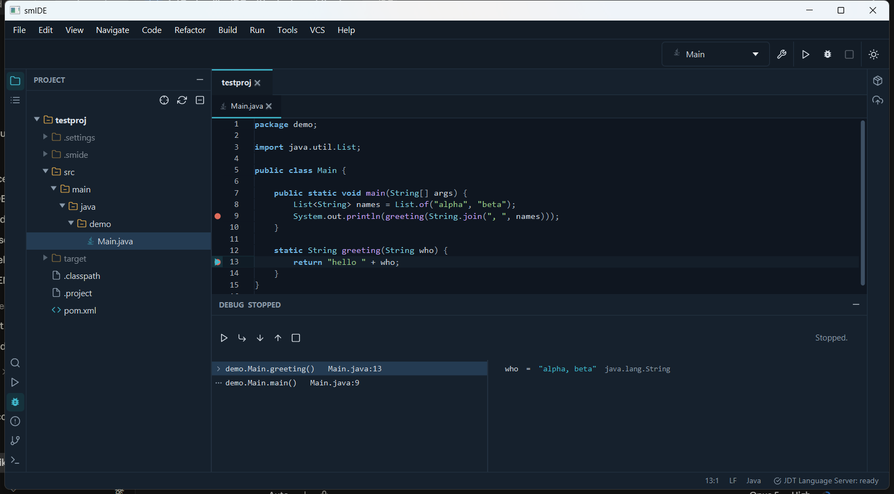

# smIDE

A desktop IDE for software development in the JetBrains mould, with MDViewer's look and
feel. JavaFX 21, Java 21, Maven. Every language is a plugin; Java is the one it is built
around.



## What works today

**Editing.** A code editor with line numbers, syntax highlighting, bracket matching,
auto-indent, comment toggling, duplicate/move line, find and replace (regex, case, whole
word), go to line, and a per-document undo history. Consolas by default, configurable in
Settings.

**Language intelligence.** A full LSP client: completion with documentation, hover docs,
go to declaration (Ctrl+B or Ctrl+click, including into library sources), find usages,
rename, reformat, context actions (Alt+Enter), document symbols, and diagnostics
underlined in the editor and listed in the Problems window.

**Java.** Maven and Gradle projects import automatically — including a repository whose
build lives a level down, such as `repo/server/pom.xml`. The Eclipse JDT Language Server
is downloaded on request and gives the intelligence above. Run configurations for
Application, Spring Boot, JUnit, Maven goal and Gradle task are detected from the project
and editable. A Maven tool window lists lifecycle phases, plugin goals and profiles.

**Debugging.** Click the gutter to set a breakpoint. Debug attaches over JDWP with JDI and
stops there: call stack, variables (objects and arrays expandable), step over/into/out,
resume, and an execution arrow in the gutter. Breakpoints are kept in
`<project>/.smide/breakpoints.json`.

**Deployment.** A Deploy tool window: package, run the built artifact, generate a
multi-stage Dockerfile, build/run/push an image, compose up, build an installer with
jpackage, copy the artifact to a server over scp and restart it, and check a Spring Boot
Actuator health endpoint.

**Workspaces.** Several folders open at once, each with its own tab of document tabs,
recent workspaces, and a session that reopens what you had.

**Navigation.** Search Everywhere (double Shift), Go to File, Find Action, Recent Files,
Find in Files, Back and Forward (Ctrl+Alt+Left/Right).

**Markdown.** MDViewer embedded as a plugin: raw, split and preview modes with its own
renderer, stylesheet, PlantUML, Mermaid and charts.

**Git.** A Changes/Log tool window with staging, commit, diffs, branches and history; pull
and push through the system `git` so your credentials apply; the branch on the status bar.

**Terminal.** A real shell per workspace, in a tool window.

## Running it

Requires JDK 21 and Maven 3.9.

```bash
mvn install -DskipTests
mvn -q -pl smide-dist exec:exec
```

Or open a folder or file directly:

```bash
mvn -q -pl smide-dist exec:exec "-Dsmide.open=C:\path\to\project"
```

On Windows, `run.ps1` does both steps.

## Plugins

| Plugin | What it adds |
|---|---|
| `smide-plugin-java` | Java, Maven/Gradle, JDT LS, run configurations, debugger, Deploy |
| `smide-plugin-markdown` | MDViewer: Markdown editing and preview |
| `smide-plugin-git` | Git changes, log, diffs, branches |
| `smide-plugin-terminal` | Terminal tool window |
| `smide-plugin-lang-kotlin` | Kotlin, kotlin-language-server |
| `smide-plugin-lang-python` | Python, pyright |
| `smide-plugin-lang-web` | JavaScript, TypeScript, HTML, CSS, JSON |
| `smide-plugin-lang-config` | YAML, XML, TOML, properties, INI, dotenv, ignore files |
| `smide-plugin-lang-shell` | Shell, PowerShell, batch |
| `smide-plugin-lang-sql` | SQL |
| `smide-plugin-lang-go` | Go, gopls |
| `smide-plugin-lang-rust` | Rust, rust-analyzer |
| `smide-plugin-lang-cpp` | C, C++, CMake, clangd |
| `smide-plugin-lang-csharp` | C#, csharp-ls |
| `smide-plugin-lang-docker` | Dockerfiles |

Language servers are never installed behind your back: the IDE offers, and downloads only
when you accept, into `~/.smide/tools`.

Writing your own is [documented](docs/PLUGIN-GUIDE.md); a plugin compiles against
`smide-api` alone.

## Layout

```
smide-api/     the plugin API
smide-core/    window, workspaces, editor, tool windows, LSP client, debugger UI
plugins/       the bundled plugins
smide-dist/    runs the whole thing from source
docs/          the plan, the plugin guide
```

## Keys

| | |
|---|---|
| Double Shift | Search Everywhere |
| Ctrl+Shift+N / Ctrl+Shift+A / Ctrl+E | Go to File / Find Action / Recent Files |
| Ctrl+Shift+F | Find in Files |
| Ctrl+B, Ctrl+click | Go to declaration |
| Alt+F7 | Find usages |
| Shift+F6 | Rename |
| Ctrl+Alt+L | Reformat |
| Alt+Enter | Context actions |
| Ctrl+Space | Completion |
| Ctrl+Q | Quick documentation |
| Ctrl+Alt+Left / Right | Back / Forward |
| Ctrl+F8 | Toggle breakpoint |
| Shift+F10 / Shift+F9 | Run / Debug |
| F9, F8, F7, Shift+F8 | Resume, step over, step into, step out |
| Alt+1..9 | Tool windows |

Every shortcut is editable in Settings → Keymap.

## State

`~/.smide` holds settings, the session, recent workspaces, downloaded tools and logs.
`<project>/.smide` holds that project's run configurations and breakpoints.
