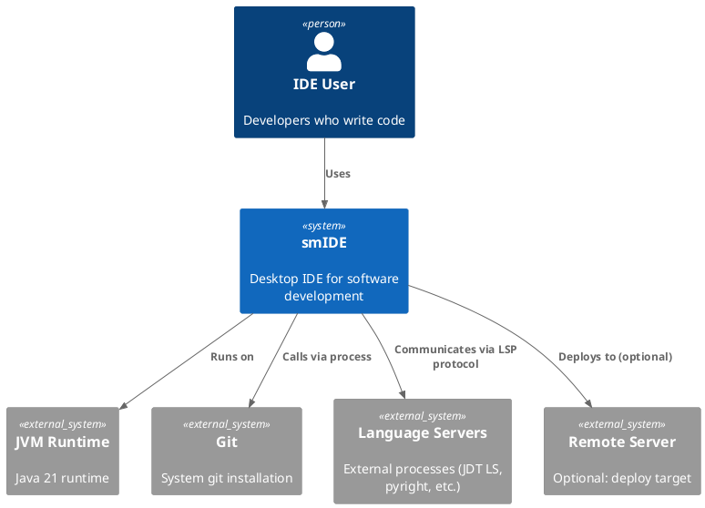
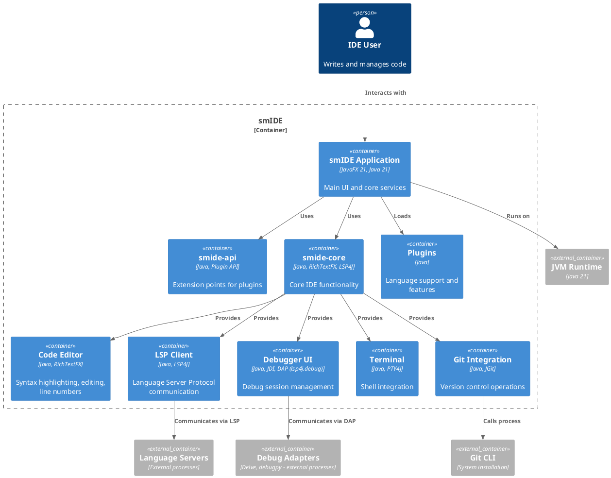
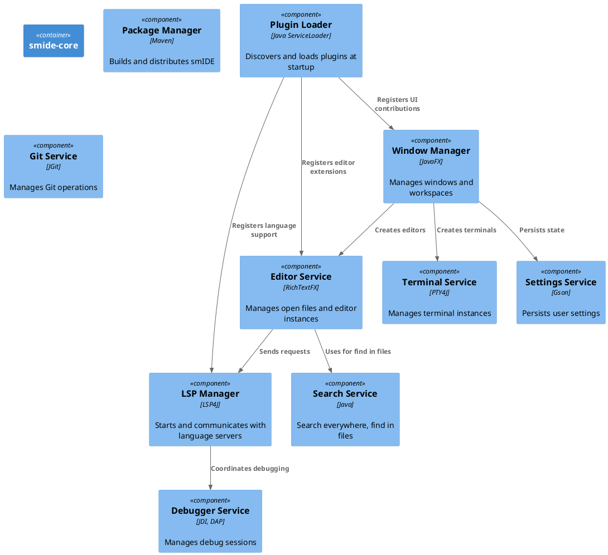
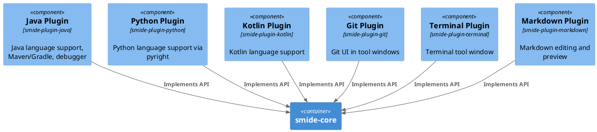
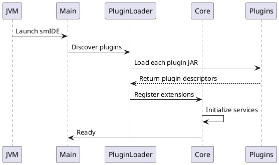
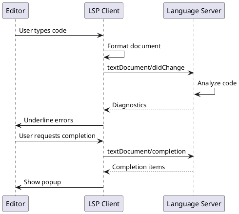
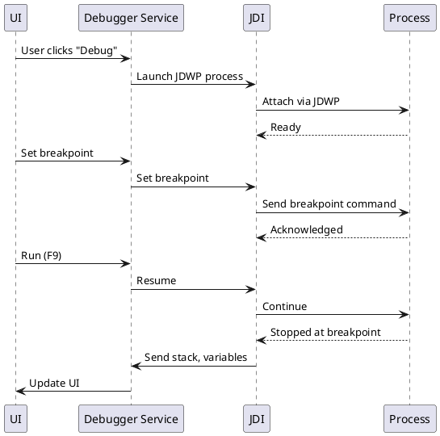
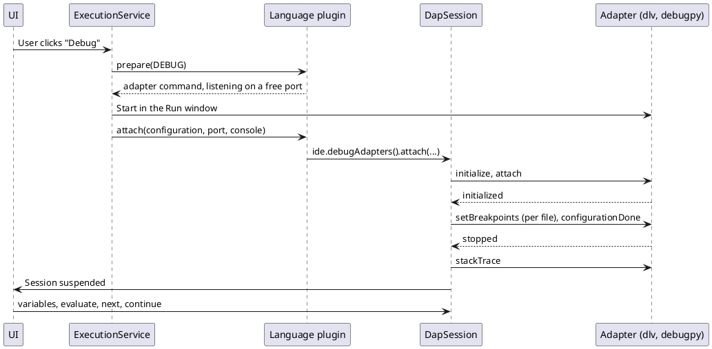
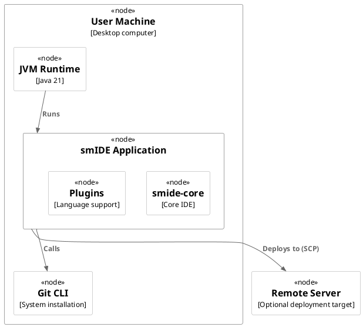

# smIDE Architecture Documentation (arc42)

## 1. Introduction and Goals

### 1.1 Purpose of This Document

This document describes the architecture of smIDE, a desktop IDE for software development. It explains how the system is structured, how components interact, and key design decisions.

### 1.2 Quality Goals

**Primary quality goals:**
- **Extensibility**: Languages and features are added as plugins
- **Performance**: Fast startup and responsive UI
- **Consistency**: Same look and feel across platforms

**Technical quality goals:**
- Plugin API stability
- Clean separation between core and language-specific code
- Minimal external dependencies in core

### 1.3 Stakeholders

| Role | Interest |
|------|----------|
| End users | IDE features, performance, stability |
| Plugin developers | API stability, documentation |
| Core developers | Architecture clarity, maintainability |
| Build/DevOps | Build process, distribution |

## 2. Architecture Context

### 2.1 System Context (C4 Context Diagram)



**Explanation:**
- **smIDE** is the main system - a desktop application
- **Users** interact with smIDE to write and manage code
- **JVM Runtime** provides the execution environment
- **Git** is used for version control operations
- **Language Servers** provide language intelligence (completion, diagnostics, etc.) via the Language Server Protocol
- **Remote Server** is an optional target for deployment

### 2.2 Software Context

smIDE runs as a standalone desktop application. It does not depend on a web server or database. All state is stored locally in the user's home directory (`~/.smide`) and in the project directory (`.smide/`).

## 3. Container View

### 3.1 Container Diagram (C4 Container Diagram)



**Key Containers:**

| Container | Technology | Responsibility |
|-----------|------------|----------------|
| **smide-app** | JavaFX 21 | Main entry point, window management, plugin loading |
| **smide-api** | Java | Plugin API: interfaces and contracts for extensions |
| **smide-core** | RichTextFX, LSP4J, JGit | Core IDE: editor, LSP client, debugger, terminal, Git |
| **Plugins** | Java | Language support (Java, Python, Kotlin, etc.) and features |
| **LSP Client** | LSP4J | Protocol communication with language servers |
| **Debugger UI** | JDI for Java; the Debug Adapter Protocol (lsp4j.debug) for Go and Python | Debug session management and UI |

## 4. Component View

### 4.1 Core Component Diagram



### 4.2 Plugin Component Diagram



## 5. Runtime Views

### 5.1 Startup Sequence



**Steps:**
1. JVM starts `smide-dist` which launches the main class
2. Plugin Loader scans for plugins in `plugins/` directory
3. Each plugin is loaded and its extensions are registered
4. Core services initialize (editor, LSP manager, debugger, etc.)
5. IDE is ready for user interaction

### 5.2 Language Intelligence Flow



**Flow:**
1. User types in editor
2. Editor sends changes to LSP Client
3. LSP Client forwards to Language Server (e.g., JDT LS for Java)
4. Language Server analyzes code and returns diagnostics, completions, etc.
5. LSP Client updates editor UI

### 5.3 Debug Session Flow



### 5.4 Debug Session Flow (Debug Adapter Protocol)

Go and Python are debugged through an adapter - Delve, debugpy - that the run configuration starts with the program, in the Run window, so the program's output stays there.



## 6. Deployment View

### 6.1 Deployment Diagram



### 6.2 Installation Layout

```
~/.smide/
├── settings.json          # User settings
├── sessions/              # Recent workspaces
├── tools/                 # Downloaded language servers
└── logs/                  # IDE logs

<project>/.smide/
├── breakpoints.json       # Breakpoint storage
└── run-configs.json       # Run configurations

smIDE/
├── smide-api/             # Plugin API (library)
├── smide-core/            # Core IDE (library)
├── plugins/               # Bundled plugins
│   ├── smide-plugin-java/
│   ├── smide-plugin-git/
│   ├── smide-plugin-terminal/
│   └── ...
└── smide-dist/            # Distribution module
```

## 7. Design Decisions

### 7.1 Plugin Architecture

**Decision:** Use Java ServiceLoader for plugin discovery.

**Rationale:**
- Simple and built into Java
- No need for a custom plugin framework
- Plugins compile against `smide-api` alone

**Consequences:**
- Plugins must follow the ServiceLoader convention
- Easy to add new plugins
- Stable API contract via `smide-api`

### 7.2 Language Intelligence via LSP

**Decision:** Use Language Server Protocol (LSP) for all language features.

**Rationale:**
- Industry standard (used by VS Code, Neovim, etc.)
- Language servers run in separate processes (crash isolation)
- Rich ecosystem of existing language servers

**Consequences:**
- Need to download and manage language servers
- Slight overhead for protocol communication
- Consistent experience across languages

### 7.3 UI Framework: JavaFX

**Decision:** Use JavaFX 21 for the UI.

**Rationale:**
- Cross-platform (Windows, macOS, Linux)
- Rich component library
- Good performance for IDE UIs

**Consequences:**
- Bundled with Java 21 runtime
- Larger distribution size
- Requires JavaFX-specific knowledge

### 7.4 Editor: RichTextFX

**Decision:** Use RichTextFX for the code editor.

**Rationale:**
- Built on JavaFX TextArea
- Supports syntax highlighting, line numbers, bracket matching
- Actively maintained

**Consequences:**
- Limited compared to custom editor (e.g., Monaco)
- Good enough for most use cases
- Easier to maintain

### 7.5 State Storage: JSON Files

**Decision:** Store settings and state in JSON files.

**Rationale:**
- Simple and human-readable
- No database overhead
- Easy to backup and version control

**Consequences:**
- No schema validation
- Manual migration needed for format changes
- Suitable for current scale

### 7.6 Git Integration: JGit + CLI Fallback

**Decision:** Use JGit for programmatic operations, fall back to system Git CLI for credential-sensitive operations.

**Rationale:**
- JGit for fast, programmatic operations (status, diff, log)
- System Git for push/pull to use OS keychain for credentials

**Consequences:**
- Two Git backends to maintain
- Better UX for credential management
- Consistent behavior with system Git

## 8. Cross-cutting Concepts

### 8.1 Plugin Extension Points

The following extension points are available for plugins:

| Extension Point | Package | Description |
|----------------|---------|-------------|
| `LanguageProvider` | `smide.api.lang` | Register a language and its LSP client |
| `EditorExtension` | `smide.api.editor` | Add features to the code editor |
| `ToolWindowProvider` | `smide.api.ui` | Add tool windows to the sidebar |
| `RunConfigurationProvider` | `smide.api.execution` | Detect and manage run configurations |
| `DebuggerProvider` | `smide.api.debug` | Add debugging support |
| `SettingsProvider` | `smide.api.settings` | Add settings pages |

### 8.2 Threading Model

- **UI thread (JavaFX Application Thread)**: every UI change happens here. `Ide.window().runLater()`
  runs straight through when it is already on this thread, so calling it from either side is safe.
- **Background work**: `Ide.window().runInBackground()` gives each task a **virtual thread**
  (`smide-background-N`). Tasks are many, short and spend their time waiting — on a build, a model,
  a file — which is what virtual threads are for. Plugins use the same service, so there is one
  place where this is decided.
- **Threads of their own**: a few things keep a platform thread, and each says why at the point it
  is created. The rule is:

  | Keep a platform thread when | Because |
  |---|---|
  | It blocks in native code for the life of the session — a process's output (`ProcessConsole`, LSP listeners, DAP, JDI), `WatchService.take()` | A virtual thread cannot be unmounted from a native frame. It would pin its carrier and never give it back. |
  | One worker in order is the point — highlighting, run markers, Maven POM parsing, manifest checks | Virtual threads add concurrency, and these need the opposite. The work is CPU-bound too, which virtual threads do not make faster. |
  | It watches for trouble — `FreezeReporter`, `MemoryWatch` | Something that reports a stuck IDE should not be queued behind whatever is stuck. |

  Everything else that needs a thread should use the background service rather than making one.

- **Java 21 note**: blocking inside `synchronized` pins a virtual thread's carrier (fixed in later
  releases). Code that runs on background threads and must block while holding a lock should use
  `ReentrantLock`, which parks the virtual thread instead.

### 8.2.1 Native code

smIDE calls no native code of its own: there is no JNI, no `System.loadLibrary`, and no native
method anywhere in the source. Everything outside the JVM is reached as a separate process
(`ProcessBuilder`) or over a socket, which is also what keeps a language server's crash from
being smIDE's crash.

If that ever has to change, it is the **Foreign Function & Memory API** (`java.lang.foreign`) and
not JNI: no second build toolchain, no native library to ship per platform, and memory access that
is checked rather than hoped for. `NativeAccessTest` fails the build if JNI appears in the source.

The one native library in the process is a dependency's: pty4j, under the terminal plugin, for a
real pseudo-terminal. That is JNI, it is JetBrains' to maintain, and it is confined to that plugin.

### 8.3 Error Handling

- **Plugin Failures**: If a plugin fails to load, log the error and continue
- **Language Server Crashes**: Restart the language server automatically
- **UI Errors**: Show error dialog to user with option to view logs

### 8.4 Logging

- **Location**: `~/.smide/logs/`
- **Format**: Plain text with timestamps
- **Levels**: DEBUG, INFO, WARN, ERROR
- **Plugin Logs**: Separate log file per plugin

## 9. Architecture Decisions Record (ADR)

### ADR-001: Plugin Architecture

**Status**: Accepted

**Context**: Need to support multiple languages and features without bloating core.

**Decision**: Use a plugin architecture with `smide-api` as the extension point.

**Consequences**: 
- Core stays small and focused
- Languages are added as plugins
- Plugin developers need to understand the API

### ADR-002: LSP for Language Intelligence

**Status**: Accepted

**Context**: Need consistent language features across all supported languages.

**Decision**: Use Language Server Protocol for all language intelligence.

**Consequences**:
- Consistent experience across languages
- Language servers run in separate processes
- Need to manage language server downloads

### ADR-003: JavaFX for UI

**Status**: Accepted

**Context**: Need cross-platform desktop UI with good performance.

**Decision**: Use JavaFX 21 for the user interface.

**Consequences**:
- Cross-platform support
- Bundled with Java 21 runtime
- Larger distribution size

### ADR-004: Virtual Threads for Background Work

**Status**: Accepted

**Context**: Background work — builds, language-server requests, the assistant's turns, file
scans — was run on a cached pool of platform threads. A session that ran for two hours had
created two hundred of them, each holding a megabyte of stack, and the crash reported as
issue #2 was an exhausted heap.

**Decision**: `Ide.window().runInBackground()` gives each task a virtual thread. Work that
blocks in native code for the life of the session, work that must be done by one worker in
order, and the watchdogs keep platform threads; see §8.2 for the rule and the reasons.

**Consequences**:
- A task costs a few hundred bytes rather than a megabyte, so nothing has to pool them.
- Threads are still named, so a thread dump still says what was running.
- On Java 21 a virtual thread that blocks inside `synchronized` pins its carrier, so background
  code that locks uses `ReentrantLock`.

### ADR-005: FFM, Not JNI, If Native Access Is Ever Needed

**Status**: Accepted

**Context**: smIDE has no native code of its own and reaches everything outside the JVM as a
separate process. Should that change — a platform API with no Java equivalent — there are two
ways to do it.

**Decision**: the Foreign Function & Memory API (`java.lang.foreign`). JNI is not to appear in
smIDE's source, and a test fails the build if it does.

**Consequences**:
- No C toolchain in the build and no native library to ship for each platform.
- Memory access is bounds-checked and lifetimes are explicit, so a mistake is an exception
  rather than the kind of crash issue #2 first looked like.
- A dependency may still use JNI — pty4j does, for the terminal — and that stays the
  dependency's business, inside its own plugin.

## 10. Glossary

| Term | Definition |
|------|------------|
| **LSP** | Language Server Protocol - protocol for language intelligence |
| **JDWP** | Java Debug Wire Protocol - protocol for debugging |
| **JDI** | Java Debug Interface - API for debugging |
| **RichTextFX** | JavaFX-based rich text editor library |
| **JGit** | Pure Java Git implementation |
| **PTY4J** | Pseudo-terminal library for Java |

## 11. Open Issues

| Issue | Status | Owner |
|-------|--------|-------|
| Plugin API versioning strategy | Open | Core team |
| Performance optimization for large projects | Open | Core team |
| Multi-cursor editing | Open | Editor team |

---

**Document Version**: 1.0  
**Last Updated**: 2026-09-13  
**Authors**: smIDE Team
